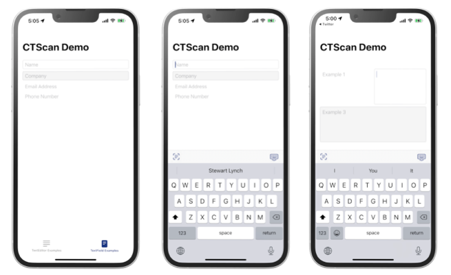
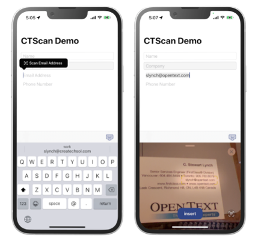
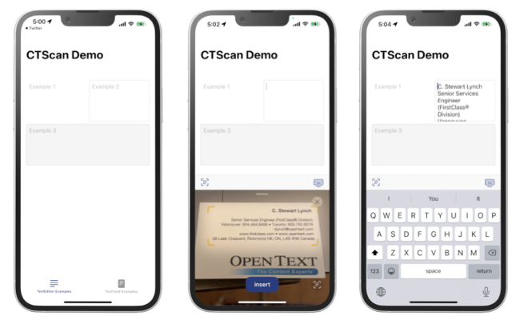

# CTScanText

<p>
    
    
    <a href="https://twitter.com/StewartLynch">
    
    </a>
</p>

A SwiftUI package that adds converts  a UITextField and UITextView to a SwiftUI version of a TextField and TextEditor view with added functionality.

## ScanTextField

A replacement option for a SwiftUI TextField

#### New Style Option

Adds a new style case which is `roundedBoderWithBackground(color:)`where you can provide a color to use as the background color.

#### Keyboard Toolbar Buttons

Adds keyboard Toolbar buttons.

##### Scan Text From Camera Toolbar Button

Adds a button that will present the scan text from camera option for all content types except for those specific contentTypes that will filter specifically for that content when scanned with camera.  When used, the cameral will not enter scanned text into the text view until the **insert** button is tapped.

##### Dismiss Keyboard Toolbar Button

A button, that when tapped will dismiss the keyboard.

### Usage

> **Note:** ScanTextField must have a frame height applied.





`````swift
VStack {
    ScanTextField("Name", text: $name)
        .textContentType(.name)
        .keyboardType(.alphabet)
        .textFieldStyle(.roundedBorder)
        .foregroundColor(.red)
        .frame(height:30)
    ScanTextField("Company", text: $company)
        .textFieldStyle(.roundedBorderWithBackground(.quaternarySystemFill))
        .frame(height:30)
    VStack {
        ScanTextField("Email Address", text: $email)
            .textContentType(.emailAddress)
            .keyboardType(.emailAddress)
        ScanTextField("Phone Number", text: $phoneNumber)
            .textContentType(.telephoneNumber)
            .keyboardType(.phonePad)
    }
    .frame(height: 60)
    Spacer()
}
`````

## ScanTextEditor

A replacement option for a SwiftUI TextEditor

#### New Style Options

Adds 3 style cases

1. `roundedBoder`: a 1 pixel rounded border around the view
2. `roundedBoderWithBackground(color:)`: a 1pixel rounded barder with specified color background
3. `.plain`: no style decoration applied (default)

#### Keyboard Toolbar Button

Adds keyboard Toolbar buttons.

##### Dismiss Keyboard Toolbar Button

A button, that when tapped will dismiss the keyboard.

#### Examples



`````swift
VStack {
    HStack {
        ScanTextEditor("Example 1", text: $text)
            .frame(height: 120)
        ScanTextEditor("Example 2", text: $text2)
             .scanTextEditorStyle(.roundedBorder)
             .frame(height: 120)
    }
        ScanTextEditor("Example 3", text: $text3)
            .scanTextEditorStyle(.roundedBorderWithBackground(.quaternarySystemFill))
            .frame(height: 120)
        Spacer()
    }
    .padding()
}
`````
## Tutorial

You can watch this YouTube tutorial to learn all about the scan to camera feature of iOS 15 along with the implementation of CTScanText and how you can modify the package to meet your own needs.

https://youtube.com/eyize9dg

## Installation

### Swift Package Manager

CTScanText  is SwiftPM-compatible. 

To install, add this package to your `Package.swift` or your Xcode project.
